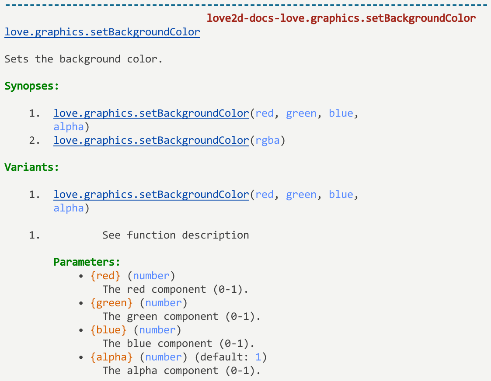
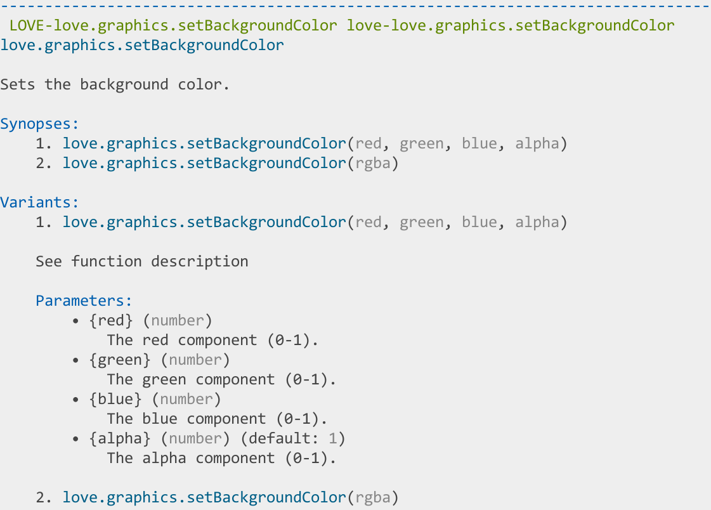

<h1 align="center">♡&nbsp;&nbsp; LÖVE2D Docs&nbsp;&nbsp;♡</h1>

[](https://github.com/love2d-community/love-api?tab=readme-ov-file#l%C3%B6ve-api)

(Neo)Vim syntax highlighting and helpfile for [LÖVE](http://love2d.org) with [Treesitter](https://github.com/nvim-treesitter/nvim-treesitter) support

The syntax part of the plugin highlights LÖVE functions, such as `love.udpate`, `love.graphics.rectangle`, and more. It also highlights `conf.lua` flags, such as `t.console`, `t.window.width`, etc.

The plugin also includes help files for LÖVE, called `love2d-docs.txt`. This file includes help for all of LÖVE's functions, as well as its types, enums, etc. It is generated from [love-api](https://github.com/love2d-community/love-api), so any discrepancies should be reported there.

<!--toc:start-->
- [📦 Installation](#-installation)
- [🔧 Neovim settings](#-neovim-settings)
  - [Commands](#commands)
  - [Keybindings](#keybindings)
- [🔧 Vim settings](#-vim-settings)
- [❓ Help File](#-help-file)
    - [Functions](#functions)
    - [Types](#types)
    - [Enums](#enums)
- [⚙️ Rebuilding the API and syntax files](#️-rebuilding-the-api-and-syntax-files)
- [🎨 Screenshots](#-screenshots)
    - [Neovim](#neovim)
    - [Vim](#vim)
- [©️ Credits](#️-credits)
<!--toc:end-->

## 📦 Installation

#### [lazy.nvim](https://github.com/folke/lazy.nvim)

```lua
require("lazy").setup(
{
    "yorik1984/love2d-docs.nvim",
    ft = "lua",
}
)
```

#### [vim-plug](https://github.com/junegunn/vim-plug)

```vim
Plug "yorik1984/love2d-docs.nvim"
```

## 🔧 Neovim settings
> [!NOTE]
> This section only for Neovim users.

```lua
---@alias LoveDocsStyleType string | "bold" | "italic" | "underline" 
---| "bold,italic" | "bold,underline" | "italic,underline" | "NONE"

---@class LoveDocsStyle
---@field love LoveDocsStyleType Style for 'love' global variable
---@field module LoveDocsStyleType Style for LÖVE modules
---@field func LoveDocsStyleType Style for LÖVE functions
---@field type LoveDocsStyleType Style for LÖVE types/objects
---@field callback LoveDocsStyleType Style for LÖVE callbacks (e.g., love.load)
---@field conf LoveDocsStyleType Style for LÖVE configuration (love.conf)

---@class LoveDocsColors
---@field LOVElove string? HEX color for 'love' global variable
---@field LOVEmodule string? HEX color for LÖVE modules
---@field LOVEfunction string? HEX color for LÖVE functions
---@field LOVEtype string? HEX color for LÖVE types/objects
---@field LOVEcallback string? HEX color for LÖVE callbacks
---@field LOVEconf string? HEX color for LÖVE configuration

---@class LoveDocsConfig
---@field enable_on_start boolean Whether to enable highlighting automatically on startup
---@field style LoveDocsStyle Custom font styles (supports combinations like "bold,italic")
---@field colors LoveDocsColors Optional table to override default HEX colors

M.defaults = {
    enable_on_start = true,
    style = {
        love     = "bold",
        module   = "NONE",
        func     = "NONE",
        type     = "NONE",
        callback = "NONE",
        conf     = "NONE",
    },
    colors = {
        LOVElove     = nil, -- Example: "#E54D95"
        LOVEmodule   = nil,
        LOVEfunction = nil,
        LOVEtype     = nil,
        LOVEcallback = nil,
        LOVEconf     = nil,
    },
}
```

Configure Treesitter styles using the following defaults:

| Highlight Group                    | HEX Color | Color Variable | Style  |
| ---------------------------------- | --------- | -------------- | ------ |
| `@variable.global.lua.love`        | `#E54D95` | `LOVElove`     | `bold` |
| `@module.bulitin.lua.love`         | `#E54D95` | `LOVEmodule`   | `NONE` |
| `@function.lua.love`               | `#2FA8DC` | `LOVEfunction` | `NONE` |
| `@type.lua.love`                   | `#2FA8DC` | `LOVEtype`     | `NONE` |
| `@function.call.lua.love.callback` | `#2FA8DC` | `LOVEcallback` | `NONE` |
| `@function.call.lua.love.conf`     | `#2FA8DC` | `LOVEconf`     | `NONE` |

### Commands

The plugin provides the following user commands to manage highlighting states.

| Command                 | Description                                              |
| ----------------------- | -------------------------------------------------------- |
| `:LOVEHighlightEnable`  | **Enables** LÖVE2D highlighting for the current session. |
| `:LOVEHighlightDisable` | **Disables** LÖVE2D highlighting and resets colors.      |
| `:LOVEHighlightToggle`  | **Toggles** the highlighting state (On/Off).             |

### Keybindings
> [!NOTE]
> These keybindings are **not enabled by default**. You can manually add them to your configuration.

| Key          | Command                 | Filetype | Description             |
| ------------ | ----------------------- | -------- | ----------------------- |
| `<leader>Lt` | `:LOVEHighlightToggle`  | `lua`    | Toggle LÖVE Highlights  |
| `<leader>Le` | `:LOVEHighlightEnable`  | `lua`    | Enable LÖVE Highlights  |
| `<leader>Ld` | `:LOVEHighlightDisable` | `lua`    | Disable LÖVE Highlights |

Example configuration for **lazy.nvim**:
```lua
{
    "yorik1984/love2d-docs.nvim",
    keys = {
        {
            "<leader>Lt",
            "<cmd>LOVEHighlightToggle<cr>",
            ft = "lua",
            desc = "Toggle LÖVE Highlights",
        },
        {
            "<leader>Le",
            "<cmd>LOVEHighlightEnable<cr>",
            ft = "lua",
            desc = "Enable LÖVE Highlights",
        },
        {
            "<leader>Ld",
            "<cmd>LOVEHighlightDisable<cr>",
            ft = "lua",
            desc = "Disable LÖVE Highlights",
        },
    },
    opts = {
        ...
    },
}
```

Or nvim api mappings for LÖVE Highlights (Lua files only)
```lua
vim.api.nvim_create_autocmd("FileType", {
    pattern = "lua",
    callback = function()
        vim.keymap.set(
            "n",
            "<leader>Lt",
            "<cmd>LOVEHighlightToggle<cr>",
            { buffer = true, desc = "Toggle LÖVE Highlights" }
        )
        vim.keymap.set(
            "n",
            "<leader>Le",
            "<cmd>LOVEHighlightEnable<cr>",
            { buffer = true, desc = "Enable LÖVE Highlights" }
        )
        vim.keymap.set(
            "n",
            "<leader>Ld",
            "<cmd>LOVEHighlightDisable<cr>",
            { buffer = true, desc = "Disable LÖVE Highlights" }
        )
    end,
})
```

## 🔧 Vim settings

The style of the syntax highlighting can be changed by setting `g:lovedocs_color_<name>` in your `.vimrc`:
```vimscript
let g:lovedocs_colors_love = 'guifg=#E54D95 ctermfg=162 gui=bold cterm=bold'
```

You can set the string to any valid highlighting specification (see `:help highlight-args`). Defaults are:
| Highlight Group  | Variable Name                | Parameters (GUI/CTERM)                          |
| ---------------- | ---------------------------- | ----------------------------------------------- |
| **Love**         | `g:lovedocs_colors_love`     | `guifg=#E54D95 ctermfg=162 gui=bold cterm=bold` |
| **Lovet**        | `g:lovedocs_colors_love`     | `guifg=#E54D95 ctermfg=162 gui=bold cterm=bold` |
| **LoveModule**   | `g:lovedocs_colors_module`   | `guifg=#E54D95 ctermfg=162`                     |
| **LoveFunction** | `g:lovedocs_colors_function` | `guifg=#2FA8DC ctermfg=38`                      |
| **LoveType**     | `g:lovedocs_colors_type`     | `guifg=#2FA8DC ctermfg=38`                      |
| **LoveCallback** | `g:lovedocs_colors_callback` | `guifg=#2FA8DC ctermfg=38`                      |
| **LoveConf**     | `g:lovedocs_colors_conf`     | `guifg=#2FA8DC ctermfg=38`                      |

## ❓ Help File

The help file can be opened with `:help love2d-docs.txt`, or by specifying a function, enum, or other identifier. The form for searching differs based on what is being searched, but each follows the same basic format: `:help love2d-docs-SEARCH`.

#### Functions

Functions are found first by their full name. For instance, if you wanted to see the parameters for `love.window.setMode`, you could search `:help love2d-docs-love.window.setMode`.

Each function features a brief description of what the function does, as well as the different forms of the function (called `Variants`) available. Each variant includes a function's return values and types (if any), as well as its parameters and their types (if any).

#### Types

Types are found by their name. For instance, if I wanted to look up the `File` type, I would do so with `:help love2d-docs-File`. The documentation includes a brief description of what the type handles, as well as a list of constructors, supertypes, subtypes, and functions.

Type functions can also be found with the function name, using self-invocation syntax. For instance, if you wanted to read about the `File` function `isEOF`, you would search `:help love2d-docs-File:isEOF`.

#### Enums

Searching for enums is similar to searching for types: just use the name. For instance, if you wanted to read about the `BufferMode` enum, you would search `:help love2d-docs-BufferMode`.

Constants are separated by dashes. If you want to read about `BufferMode`'s constant `full`, you could search `:help love2d-docs-BufferMode-full`.

## ⚙️ Rebuilding the API and syntax files

If you wish to re-build [love-api](https://github.com/love2d-community/love-api) from source, follow the steps below:
* Ensure that the following commands will run from the command line:
    - `git`
    - `lua`
    - `nvim` or `vim`
 
    You may also edit [`build/env.txt`](build/env.txt) to set custom values. For instance, if want to use Lua 5.2 instead of 5.3, you may change the line with `lua="lua"` to be `lua="lua5.2"` (assuming this command brings up the Lua 5.2 interpreter on your system).
* Next, run [`build/gen.bat`](build/gen.bat) (Windows) or [`build/gen.sh`](build/gen.sh) (Mac/Linux). This should generate new files:
    - [`love2d-docs.txt`](doc/love2d-docs.txt)
    - [`after/queries/lua/highlights.scm`](after/queries/lua/highlights.scm)
    - [`after/syntax/lua.vim`](after/syntax/lua.vim)
    - [`test/example/api_full_list.lua`](test/example/api_full_list.lua)
    - [`test/example/conf.lua`](test/example/conf.lua)

You may need to allow the files to be able to run. You need to do this for **every** file that ends with `.bat` if you're on Windows, or `.sh` for Mac/Linux. Windows users will need to "Unblock" the `.bat` files. See [here](https://blogs.msdn.microsoft.com/delay/p/unblockingdownloadedfile/) for how to unblock files. For Mac/Linux users, you will need to `chmod` the `.sh` files to allow execution.

## 🎨 Screenshots

#### Neovim 
- [newpaper.nvim](https://github.com/yorik1984/newpaper.nvim)



#### Vim
[papercolor-theme](https://github.com/NLKNguyen/papercolor-theme)


## ©️ Credits

Original Authors [Davis Claiborne](https://github.com/davisdude) — Initial development and maintenance of the original [vim-love-docs](https://github.com/davisdude/vim-love-docs).
