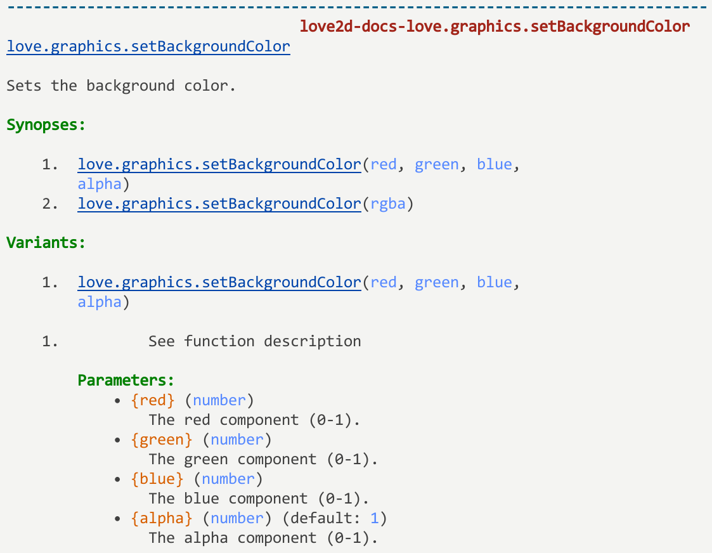
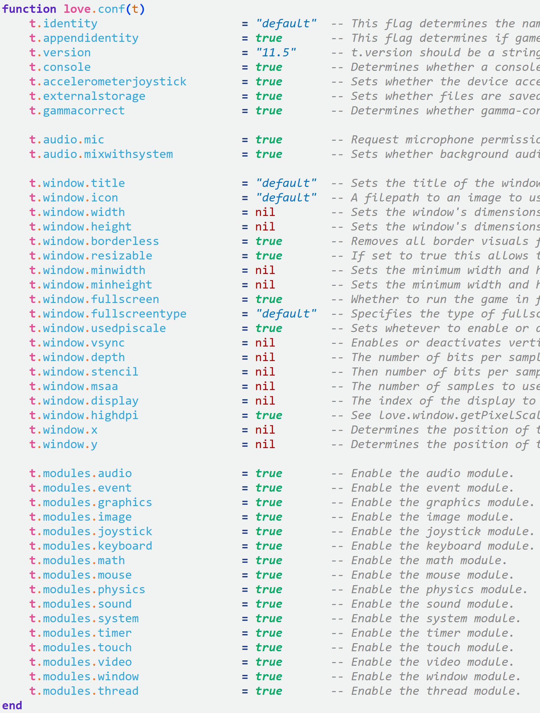
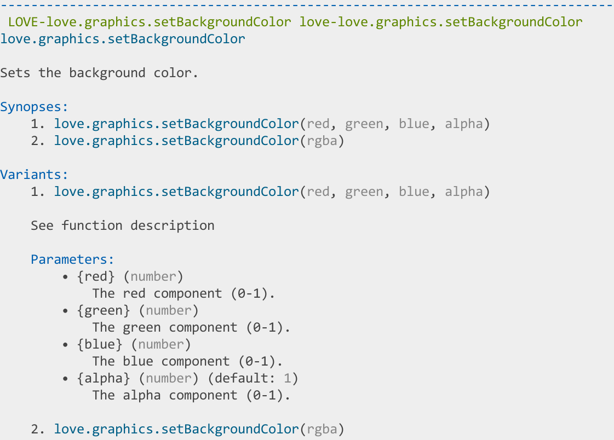

<h1 align="center">♡&nbsp;&nbsp; LÖVE2D Docs&nbsp;&nbsp;♡</h1>

[](https://github.com/yorik1984/love2d-docs.nvim/actions/workflows/update-love-api.yml)
[](https://github.com/yorik1984/love2d-docs.nvim/blob/main/LICENSE)
[](https://www.lua.org/)
[](https://github.com/love2d-community/love-api)
[](https://neovim.io/)
[](https://www.vim.org/)

**Beautiful syntax highlighting 📝 | Comprehensive documentation 📚 | Treesitter support 🌳**

</div>

## ✨ About

**love2d-docs.nvim** is a comprehensive plugin for [Neovim](https://neovim.io/) and [Vim](https://www.vim.org/) that brings the entire [LÖVE](http://love2d.org) game framework documentation right into your editor.

- 🎨 **Syntax Highlighting** — Colors LÖVE functions, modules, types, and callbacks
- 📖 **Built-in Help** — Complete LÖVE API documentation accessible via `:help love2d-docs-love`
- 🌳 **Treesitter Support** — Full integration with Neovim's Treesitter
- 🔧 **Customizable** — Flexible styling options for both Neovim and Vim

### Features highlighted:

```lua
-- LÖVE functions light up automatically
love.graphics.rectangle("fill", 100, 100, 200, 200)

-- Callbacks are specially highlighted
function love.load()
    -- 'load' stands out with LOVEcallback highlight
end

-- Configuration flags in conf.lua get special treatment

-- work with treesitter too
-- love.conf = function(t)
function love.conf(t)
    t.window.width = 800
    t.window.height = 600
end
```

<!-- TOC -->

## Table of Contents

- [📦 Installation](#-installation)
- [🔧 Configuration](#-configuration)
  - [📍 Neovim Settings](#-neovim-settings)
  - [🔧 Vim settings](#-vim-settings)
- [📚 Documentation](#-documentation)
  - [♡ API Help Files](#-api-help-files)
  - [❓ Plugin Help](#-plugin-help)
- [🔄 Rebuilding the API](#-rebuilding-the-api)
  - [🤖 Automated Workflow](#-automated-workflow)
  - [✋ Manual Generation (Optional)](#-manual-generation-optional)
- [🎨 Screenshots](#-screenshots)
- [📚 References & Related Projects](#-references--related-projects)
- [©️ Credits](#-credits)

<!-- /TOC -->

## 📦 Installation

#### [lazy.nvim](https://github.com/folke/lazy.nvim)

```lua
require("lazy").setup({
    "yorik1984/love2d-docs.nvim",
    ft = "lua",
    opts = {},
})
```

#### [vim-plug](https://github.com/junegunn/vim-plug)

```vim
Plug "yorik1984/love2d-docs.nvim"
```

## 🔧 Configuration

### 📍 Neovim Settings

> [!NOTE]
> This section only for **Neovim** users

```lua
---@alias LoveDocsStyleType string | "bold" | "italic" | "underline"
---| "bold,italic" | "bold,underline" | "italic,underline" | "NONE"

---@class LoveDocsStyle
---@field love LoveDocsStyleType Style for 'love' global variable
---@field module LoveDocsStyleType Style for LÖVE modules
---@field type LoveDocsStyleType Style for LÖVE types/objects
---@field dot LoveDocsStyleType Style for LÖVE dot and colon operator
---@field func LoveDocsStyleType Style for LÖVE functions
---@field method LoveDocsStyleType Style for LÖVE methods
---@field callback LoveDocsStyleType Style for LÖVE callbacks (e.g., love.load)
---@field conf LoveDocsStyleType Style for LÖVE configuration (love.conf)

---@class LoveDocsColors
---@field LOVElove string? HEX color for 'love' global variable
---@field LOVEmodule string? HEX color for LÖVE modules
---@field LOVEtype string? HEX color for LÖVE types/objects
---@field LOVEdot string? HEX color for LÖVE dot and colon operator
---@field LOVEfunction string? HEX color for LÖVE functions
---@field LOVEmethod string? HEX color for LÖVE methods
---@field LOVEcallback string? HEX color for LÖVE callbacks
---@field LOVEconf string? HEX color for LÖVE configuration

---@class LoveDocsConfig
---@field enable_on_start boolean Whether to enable highlighting automatically on startup
---@field notifications boolean Whether to enable notifications
---@field style LoveDocsStyle Custom font styles (supports combinations like "bold,italic")
---@field colors LoveDocsColors Optional table to override default HEX colors
require("love2d-docs").setup({
    enable_on_start = true,
    notifications = true,
    style = {
        love     = "bold",      -- 'love' global variable
        module   = "NONE",      -- LÖVE modules (graphics, audio, etc.)
        type     = "NONE",      -- LÖVE types/objects
        dot      = "NONE",      -- Dot and colon operators
        func     = "NONE",      -- LÖVE functions
        method   = "NONE",      -- LÖVE methods
        callback = "NONE",      -- Callbacks (load, update, draw)
        conf     = "NONE",      -- Configuration flags
    },
    colors = {
        LOVElove     = nil,     -- Example: "#E54D95"
        LOVEmodule   = nil,
        LOVEtype     = nil,
        LOVEdot      = nil,
        LOVEfunction = nil,
        LOVEmethod   = nil,
        LOVEcallback = nil,
        LOVEconf     = nil,
    },
})
```

> [!TIP]
> Add this configuration to enable auto-highlighting in LÖVE2D projects

```lua
{
    "yorik1984/love2d-docs.nvim",
    dependencies = {
        "S1M0N38/love2d.nvim",  -- A simple Neovim plugin to build games with LÖVE
    },
    ft = "lua",
    opts = {
        enable_on_start = false,
        ...
    },
    config = function(_, opts)
        require("love2d-docs").setup(opts)

        local group = vim.api.nvim_create_augroup("Love2DAutoStart", { clear = true })
        vim.api.nvim_create_autocmd({ "VimEnter", "BufReadPost" }, {
            group = group,
            pattern = { "*.lua" },
            callback = function()
                local configModule = require("love2d-docs.config")
                configModule.setup(opts)
                local config = configModule.config
                config.enable_on_start = true

                local ok, love2d = pcall(require, "love2d")
                if ok and type(love2d.is_love2d_project) == "function" then
                    if love2d.is_love2d_project() then
                        require("love2d-docs.util").load(config)
                    end
                end
            end,
        })
    end,
}
```

#### Treesitter Highlight Groups
Configure Treesitter styles using the following defaults:

| Highlight Group                    | HEX Color | Color Variable | Style  |
| ---------------------------------- | --------- | -------------- | ------ |
| `@variable.global.love.lua`        | `#E54D95` | `LOVElove`     | `bold` |
| `@module.bulitin.love.lua`         | `#E54D95` | `LOVEmodule`   | `NONE` |
| `@type.love.lua`                   | `#E54D95` | `LOVEtype`     | `NONE` |
| `@punctuation.dot.love.lua`        | `#E54D95` | `LOVEdot`      | `NONE` |
| `@function.love.lua`               | `#2FA8DC` | `LOVEfunction` | `NONE` |
| `@function.method.love.lua`        | `#2FA8DC` | `LOVEmethod`   | `NONE` |
| `@function.call.love.callback.lua` | `#2FA8DC` | `LOVEcallback` | `NONE` |
| `@function.call.love.conf.lua`     | `#2FA8DC` | `LOVEconf`     | `NONE` |

#### Commands

The plugin provides the following user commands to manage highlighting states.

| Command                 | Description                                              |
| ----------------------- | -------------------------------------------------------- |
| `:LOVEHighlightEnable`  | **Enables** LÖVE2D highlighting for the current session. |
| `:LOVEHighlightDisable` | **Disables** LÖVE2D highlighting and resets colors.      |
| `:LOVEHighlightToggle`  | **Toggles** the highlighting state (On/Off).             |

#### Recommended Keybindings

Example configuration with [lazy.nvim](https://github.com/folke/lazy.nvim):

```lua
{
    "yorik1984/love2d-docs.nvim",
    keys = {
        { "<leader>Lt", "<cmd>LOVEHighlightToggle<cr>", ft = "lua", desc = "Toggle LÖVE Highlights" },
        { "<leader>Le", "<cmd>LOVEHighlightEnable<cr>", ft = "lua", desc = "Enable LÖVE Highlights" },
        { "<leader>Ld", "<cmd>LOVEHighlightDisable<cr>", ft = "lua", desc = "Disable LÖVE Highlights" },
    },
}
```

### 🔧 Vim settings

The style of the syntax highlighting can be changed by setting `g:lovedocs_color_<name>` in your `.vimrc`:

```vimscript
let g:lovedocs_colors_love = 'guifg=#E54D95 ctermfg=162 gui=bold cterm=bold'
```
You can set the string to any valid highlighting specification (see `:help highlight-args`). Defaults are:
| Highlight Group  | Variable Name                | Parameters (GUI/CTERM)                          |
| ---------------- | ---------------------------- | ----------------------------------------------- |
| **Love**         | `g:lovedocs_colors_love`     | `guifg=#E54D95 ctermfg=162 gui=bold cterm=bold` |
| **Lovet**        | `g:lovedocs_colors_module`   | `guifg=#E54D95 ctermfg=162`                     |
| **LoveDot**      | `g:lovedocs_colors_module`   | `guifg=#E54D95 ctermfg=162`                     |
| **LoveModule**   | `g:lovedocs_colors_module`   | `guifg=#E54D95 ctermfg=162`                     |
| **LoveType**     | `g:lovedocs_colors_type`     | `guifg=#E54D95 ctermfg=162`                     |
| **LoveFunction** | `g:lovedocs_colors_function` | `guifg=#2FA8DC ctermfg=38`                      |
| **LoveMethod**   | `g:lovedocs_colors_function` | `guifg=#2FA8DC ctermfg=38`                      |
| **LoveCallback** | `g:lovedocs_colors_callback` | `guifg=#2FA8DC ctermfg=38`                      |
| **LoveConf**     | `g:lovedocs_colors_conf`     | `guifg=#2FA8DC ctermfg=38`                      |

## 📚 Documentation

The plugin provides **two types of documentation**:

### ♡ API Help Files

Access the complete LÖVE API documentation `:help love2d-docs-*`:

| What to find      | Command Example                         |
| ----------------- | --------------------------------------- |
| **Function**      | `:help love2d-docs-love.window.setMode` |
| **Type**          | `:help love2d-docs-File`                |
| **Type Method**   | `:help love2d-docs-File:isEOF`          |
| **Enum**          | `:help love2d-docs-BufferMode`          |

### ❓ Plugin Help

Get help on configuring the plugin itself `:help love2d-docs-config`. This opens documentation about available options, commands, and customization.

## 🔄 Rebuilding the API

### 🤖 Automated Workflow

This plugin uses **GitHub Actions** to automatically stay up-to-date with the latest LÖVE API:

| Feature      | Details                                                                   |
| ------------ | ------------------------------------------------------------------------- |
| **Schedule** | Every Monday at 00:30 UTC                                                 |
| **Trigger**  | Manual dispatch via Actions tab                                           |
| **Source**   | [love2d-community/love-api](https://github.com/love2d-community/love-api) |
| **Updates**  | Documentation, syntax files, and Treesitter queries                       |

**How it works:**

1. 🔄 Fetches the latest LÖVE API specification
2. 📝 Generates help files (`love2d-docs.txt`)
3. 🎨 Updates syntax highlighting rules
4. 🌳 Refreshes Treesitter queries
5. 🚀 Automatically commits changes to the repository
6. 📌 Creates version branches (e.g., `11.5`, `12.0`) for API version tracking

> [!NOTE]
> The badge at the top of this README always shows the current LÖVE API version supported by this plugin.

### ✋ Manual Generation (Optional)

> [!TIP]
> **You don't need to do this!** The automated workflow keeps everything up-to-date.  
> Manual generation is only for:
> - Testing custom modifications
> - Contributing to plugin development
> - Offline environments without GitHub Actions

If you still want to generate files manually:

- Prerequisites:
```
# Ensure these are installed
git --version
lua -v           # Lua 5.1
nvim --version   # or vim
```

- Configure (optional):
Edit build/env.txt to set custom paths:
```
lua="lua5.1"     # Change to your Lua version
nvim="nvim"      # or "vim"
```

- Run the generator:
```bash
# On Linux/Mac
chmod +x build/gen.sh
./build/gen.sh

# On Windows
build/gen.bat
```

- Generated files:
    - 📄[`love2d-docs.txt`](doc/love2d-docs.txt) — API and plugin documentation
    - 🌳[`after/queries/lua/highlights.scm`](after/queries/lua/highlights.scm) — Treesitter queries
    - 🎨[`after/syntax/lua.vim`](after/syntax/lua.vim) — Vim syntax file
    - 🧪[`test/example/api_full_list.lua`](test/example/api_full_list.lua) — Test preview file with full API-list
    - ⚙️[`test/example/conf.lua`](test/example/conf.lua) — Test preview `love.conf()`

## 🎨 Screenshots

### Neovim with [newpaper.nvim](https://github.com/yorik1984/newpaper.nvim)

<div align="center">
  
  <br><br>
  
</div>

### Vim with [papercolor-theme](https://github.com/NLKNguyen/papercolor-theme)

<div align="center">
  
</div>

## 📚 References & Related Projects

Expand your LÖVE development toolkit with these complementary resources:

#### 🔌 [EmmyLuaLOVEGenerator](https://github.com/yorik1984/love2d-definitions)
A powerful script that automatically generates LuaCATS type annotations for the entire LÖVE framework.

* **What it does:** Creates `---@class` and `---@alias` definitions for perfect autocompletion and type checking in IDEs  with LuaCATS, and others.
* **✨ Key Features:**
    * **🤖 Automated Updates:** Uses GitHub Actions to stay in sync with the official love-api, just like this docs plugin.
    * **📦 Ready-to-Use:** Provides a pre-generated `library/` folder that you can directly add to your workspace library.
    * **🧠 Smart Type System:** Intelligently handles type unions, plural forms (e.g., `tables` → `table[]`), optional parameters, and function overloads.
    * **📌 Version Branches:** Includes branches for specific LÖVE versions (e.g., `11.5`), so you can use annotations that match your project.

> **💡 Pro Tip:** Use this generator alongside **love2d-docs.nvim** for the ultimate LÖVE development setup—get both beautiful inline syntax highlighting *and* intelligent IDE autocompletion.

## ©️ Credits

* Current Maintainer: [yorik1984](https://github.com/yorik1984) — Ported to Neovim with Treesitter support and continuous updates
* Original Author: [Davis Claiborne](https://github.com/davisdude) — Created and maintained the original [vim-love-docs](https://github.com/davisdude/vim-love-docs)
* Powered by: [love-api](https://github.com/love2d-community/love-api) — Community-maintained LÖVE API specification

<div align="center">
  <sub>
    Built with ♡ for the LÖVE community
    <br>
    <a href="https://github.com/yorik1984/love2d-docs.nvim/issues">Report Issue</a> ·
    <a href="https://github.com/yorik1984/love2d-docs.nvim/discussions">Discussion</a> ·
    <a href="https://love2d.org/">LÖVE2D</a>
  </sub>
</div>
